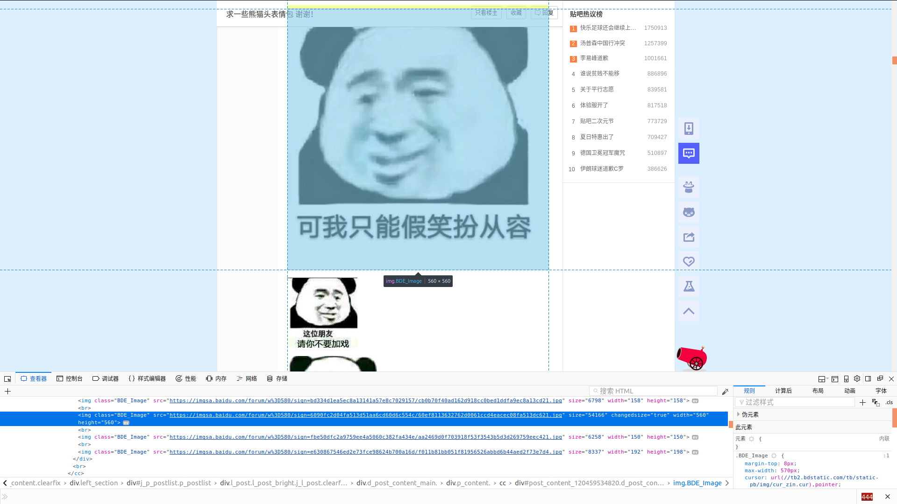
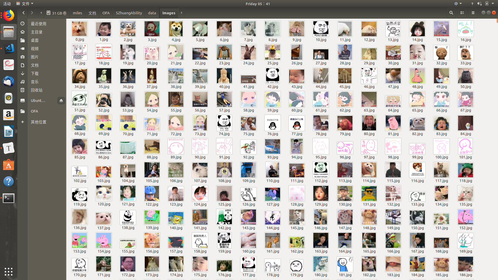
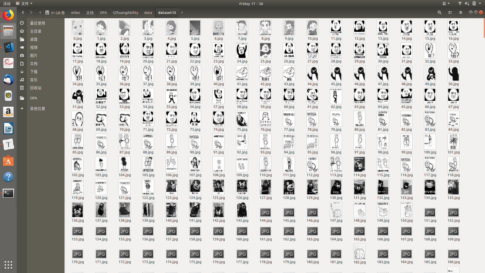
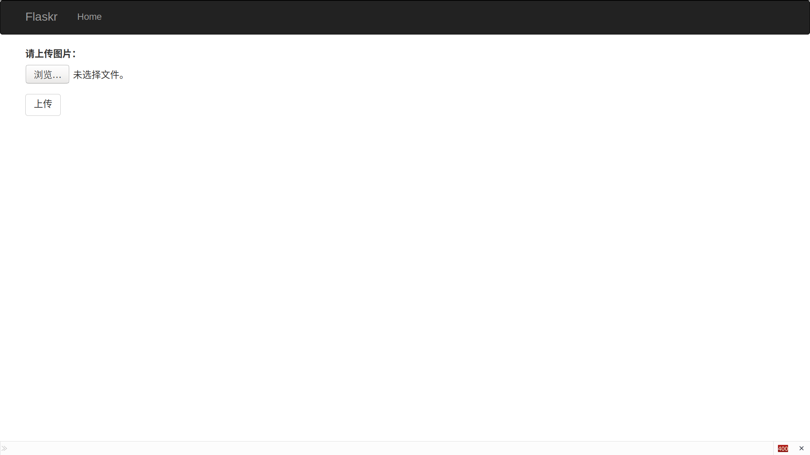
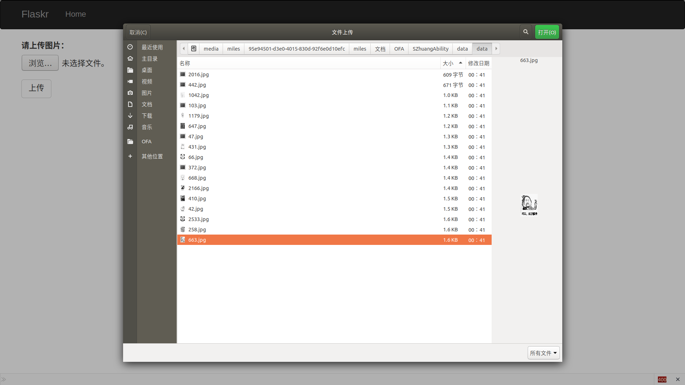
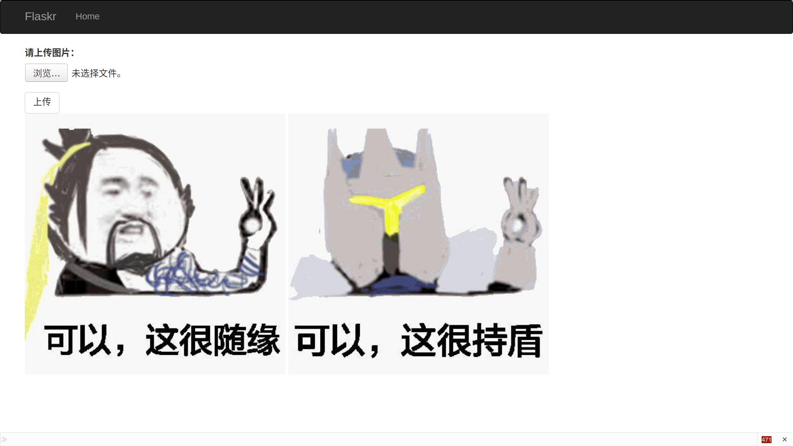

# SZhuangAbility 智能表情生成系统

- [GitHub](https://github.com/liuyang6419/SZhuangAbility)

### 项目简介

**SZA**是一个可以根据用户输入的表情，基于图像检索技术提供与其输入相似图片的系统，基于用户的输入以及数据集的不同，可以实现任何种类图片的检索。

**SZA**基于Keras，采用均方误差代价函数训练由4个ReLU层和1个Sigmoid层组成的自编码器对事先从网络上爬取并转为大小为300*300的灰度图像进行分类，并使用局部敏感哈希方法进行快速图像检索，训练1000代之后训练集损失为0.0287，验证集损失函数为0.0482，在某些图像上可以得到较为满意的输出结果。

### 项目成员

- 李舒航（项目经理，客户端代码开发）
  - Email: 2528114368@qq.com
  - GitHub: https://github.com/LIShuHang1
- 刘洋（产品，客户端代码开发）
  - Email: 303308260@qq.com
  - GitHub: https://github.com/liuyang6419
- 夏广伟（前端设计，服务器代码开发）
  - Email: 374573868@qq.com
  - GitHub: https://github.com/GuangweiXia

### **任务分解 (Finish)**

|              任务项              |  Status  |
| :------------------------------: | :------: |
|         **爬虫获取图片**         | **Done** |
|          **图片Resize**          | **Done** |
|       **局部敏感哈希索引**       | **Done** |
| **训练自编码器模型进行图像分类** | **Done** |
|  **将模型部署到Web和服务器端**   | **Done** |
|        **提升和优化模型**        | **Done** |

### 运行效果：

爬虫从页面匹配数据：

爬取到的图片：

图片Resize和转为灰度图像：

运行系统：

